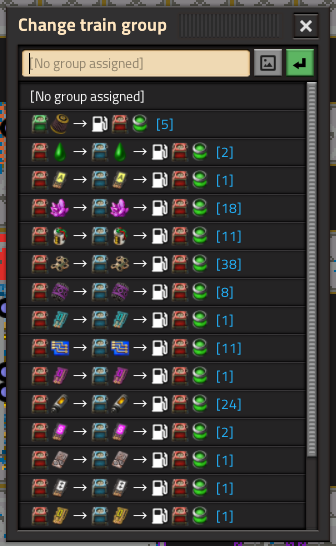
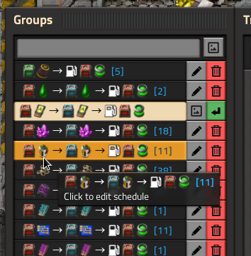

# Train Groups

Train Groups is a Factorio mod enabling you to sync the schedules of multiple trains.

## Download

Download on the [Factorio mod portal](https://mods.factorio.com/mod/TrainGroups).

## Features

The mod adds a new button to the top of the train GUI.

Clicking this button allows you to select or create a train group.

Changing to a group will sync the train's schedule to the other trains in that group.

Any changes made to a schedule will be immediately reflected in the schedules of all trains in the group. Temporary stations will be ignored.

The mod also adds a widget to the train overview GUI that lists your groups, and allows you to rename or delete them.

If you have no groups, the mod will offer to auto-create them based on train schedule.

## Compatibility

In general, any changes made to schedules by mods will be ignored; only edits made by players will be synced. The following mods have extra compatibility:

### Train Control Signals

The skip signal from [Train Control Signals](https://mods.factorio.com/mod/Train_Control_Signals) will be filtered out when syncing schedules. This causes it to temporarily disappear from the other trains when the schedule is edited, but does not affect the functionality of TCS.

### Train Schedule Signals

All wait conditions on stations utilizing [Train Schedule Signals](https://mods.factorio.com/mod/TrainScheduleSignals) will be ignored, as those are managed directly by TSS.
