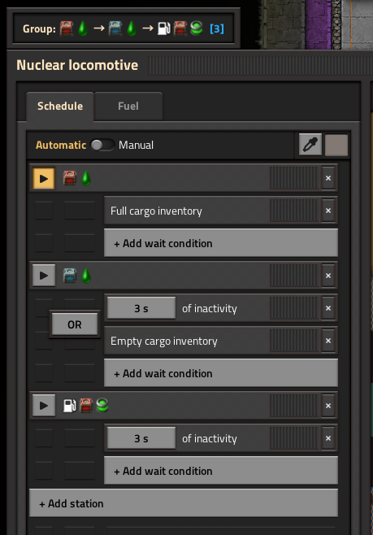

# Train Groups

Train Groups is a Factorio mod enabling you to sync the schedules of multiple trains. Includes support for the [Train Control Signals](https://mods.factorio.com/mod/Train_Control_Signals) mod.

## Download

Download on the [Factorio mod portal](https://mods.factorio.com/mod/TrainGroups).

## Features

The mod adds a group dropdown to the top of the train GUI.

Clicking this dropdown allows you to view all created groups, or create a new group.

Changing to a group will sync the train's schedule to the other trains in that group.

Any changes made to a schedule will be immediately reflected in the schedules of all trains in the group. Temporary stations will be ignored.

## Compatibility

The skip signal from [Train Control Signals](https://mods.factorio.com/mod/Train_Control_Signals) will be filtered out when syncing schedules. This causes it to temporarily disappear from the other trains when the schedule is edited, but does not affect the functionality of TCS.

Any changes made to schedules by mods (e.g. TCS, LTN, or TSM) will be ignored. Only edits made by players will be accounted for.
